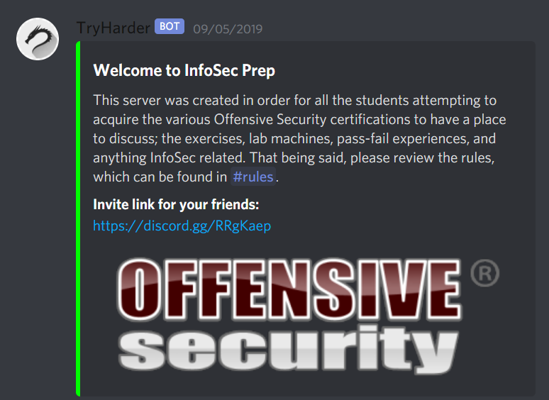

# My OSCP Journey

It seems to be a tradition to write a cheesy 🧀 blog post after you've earned your OSCP, here I am.
TLDR:
- Laughed at people calling it a 'journey'
- Failed, reconsidered the whole 'journey' thing
- Got more motivation from failing than ever before
- Passed

## Background
I'm a Software Engineer by trade, worked in companies large and small, worked with super old tech, and the shiny new stuff on the cloud, _serverless_ _typescript_ _functional programming_ and a bunch more buzzwords. As a naive 14 year old I always wanted to become a super l33t hax0r. Slightly forgot that dream for a while, but after 10 years in the Software Field I really needed some kind of change. Long story short, I stumbled on the OSCP and liked the concept a lot. A course that teaches you ethical hacking! Sounds fun!

"Let's just try it, how hard can it be?" - I thought to myself and just went and purchased the PWK Course. 

## Starting out
I spent a while reading the PWK PDF and actually learned a lot more than I expected. There is a lot of fun stuff in there (Did you know [PowerShellEmpire](http://www.powershellempire.com/) let's you [Rick-Roll](https://www.youtube.com/watch?v=dQw4w9WgXcQ) people?). I also purchased a subscription to HackTheBox (which I liked primarily because you need to do a challenge to even create an account). Doing the starting path and easy boxes with a lot of watching [ippsec's videos](https://www.youtube.com/c/ippsec/videos) to understand the basics. This really helped me a ton in the beginning. I've heard a lot of good things about the rooms in TryHackMe as well, but personally I did not use this platform. Cracking some of the non-retired machines on HackTheBox (no writeups available for these) felt damn good!

I only purchased 30 days of the PWK Lab time, which had almost ran out by the time I finished the PDF, so I only got the recommended starting point machines done, before the time ran out. Still highly recommend starting out with these in the lab, as they also mention which chapters are covered by these machines.

After my lab time ran out, I've used [TJNulls list for OSCP-like boxes](https://docs.google.com/spreadsheets/d/1dwSMIAPIam0PuRBkCiDI88pU3yzrqqHkDtBngUHNCw8/) and did most of the HackTheBox ones. As I had the HackTheBox VIP subscription, I was able to look up writeups much more easily and could learn a lot from the masters. This also had the caveat, that it is easy to get into the habit of just looking up the solution once you get stuck (At least set yourself a timer to try for 2h+ before 'cheating', you'll learn much more like this.).

## First exam try
Once I did most of the HackTheBox machines from the google sheet, I felt quite ready to take on the exam. I was able to do most easy/medium machines without looking up the solution in a reasonable amount of time.
So I signed up, and also did some Vulnhub machines, the OSCP VulnApps buffer overflows to prepare for the 25pt Buffer Overflow machine in the lab.

My exam was scheduled to start at 4 PM, I was so nervous that I slept really bad the night before and already felt sluggish. During the setup phase, you're expected to run a diagnostics script to verify your VPN connection. It had some issue with my DNS, so I needed to troubleshoot that. The proctors told me it looks like I was connecting from a datacenter. After turning off my Pi-Hole and proving to them that I was connected to a residential connection, I was even more nervous than before and already lost a good hour of exam time.

I read a lot about strategies on what to tackle first, so I did what most people recommended: Doing the buffer overflow machine first and letting [AutoRecon](https://github.com/Tib3rius/AutoRecon) run in the background for all the other hosts. _Always be scanning is a good word of wisdom_ 

After struggling a bit to make the buffer overflow work on the target machine (needed to revert it before it would work), still extremely nervous, I set out to try my first 20 point machine. After about 20min I was pretty sure I found a vulnerability that would let me exploit it, none of my attempts seemed to actually work. It just would not budge. 

This is where I committed my next big mistake, I kept coming back to that damn 20 pointer, hopping between boxes as soon as I got another Idea. So I barely touched my 10 point machine or the other 20 pointer.
I also didn't really take any breaks, I always felt like I was sooooo close!

After switching to the 25 pointer, I found a vulnerability pretty fast, but exploiting it seemed impossible again, I tried a lot of techniques. Techniques that were way out of scope for the OSCP (that should've been an indication that I was on the wrong path).
This viscous cycle continued for all the other boxes. I found the attack vector, but just could not follow through at all. Even the 10 pointer seemed like a cruel joke. After I slept a horrible 5 hours, already thinking to myself that I must've failed, I reemerged and tried a bunch of more stuff that I could think of.

Still. Nothing.

It was extremely frustrating. I had run out of ideas on what to try. I ran metasploit against one machine, but that did not help me at all. After calming down a bit and going on a walk, I still did not have any 💡 turning on in my head. I tried stuff until I watched the VPN close in front of my eyes. I knew I failed this time.

## Prep for second exam
After recovering a bit and sleeping a lot, I actually expected to be devastated, but actually the opposite happened. My ass was handed to me, and somehow that inspired me more than ever. I was so excited about learning about CyberSec I could barely go to sleep, continuing reading https://reddit.com/r/netsec and hacker news in bed. It really sparked my interest more than I ever thought.
So I re-purchased another Exam-Attempt and another 30 days of lab time. I built a spreadsheet and wanted to conquer at least 30 machines (on average 1 a day) during my lab time.

### What the labs made different to HTB
In my opinion the labs are much more accurate in terms of real world machines. You get angry firewalls and AVs that you need to dodge, on HTB a lot of the time you are given 'quality of life' features like `nc` binaries with the `-e` option on the vulnerable hosts. Not so in the PWK labs, you'll need to try a bunch of different reverse shells for it to work.

This is an invaluable resource:

https://github.com/swisskyrepo/PayloadsAllTheThings/blob/master/Methodology%20and%20Resources/Reverse%20Shell%20Cheatsheet.md

The machines also won't just allow any port, you need to find out which are open and then use those for your shells.
The lab contains a few hidden gems like _possibly_ retired exam machines (the loot you find on those will indicate as such), so it's a much better approximation of what you will find in the exam.
I also enjoyed the pivoting part immensely, gaining access to the 'hidden' departments really felt like being a real hacker.

The infamous big 4 were also a nice challenge and I can definitely recommend them.

### Hacktricks
Hacktricks has been one of the best resources I could find so far, it has tons of guides for grouped by port / type of exploitation / software etc. I can highly recommend it
https://book.hacktricks.xyz/
### Proving Grounds Practice
Another platform I enjoyed using during my time was [Offsec's Proving Grounds Practice](https://www.offensive-security.com/labs/individual/) I think it is worth its $19 per month and gives you a wide variety of machines to exploit.
Some gripes I had with this platform though were:
- Writeups can only be accessed after working 1.5h on it, if you stop and continue the next day, this counter is reset. I understand the reasoning behind it, but I would definitely not recommend this platform for any kind of beginner that relies on writeups
- Writeups can not be looked at, after rooting the machine and submitting the flags. This really bothered me, you have no way to learn what other methods of exploitation existed or if you used an unintended way of exploitation (i.e. Kernel exploit, if another vulnerability was intended)

Proving ground practice also contained more up-to-date machines than the lab, so you'd get to experience vulnerabilities in more modern software.
Exploiting the machines also gives you some kind of idea what Offsec considers to be easy, medium and hard boxes, which can be valuable in the exam. As a software engineer I noticed as soon as a machine requires you to read / write code the community considers it as 'Very Hard'.

### Udemy

I also signed up the for excellent Privilege Escalation Courses on Udemy from Tib3rius. It will give you much more background on what LinPEAS and WinPEAS will output, which is nice to fill gaps in your knowledge.

https://www.udemy.com/course/linux-privilege-escalation/

https://www.udemy.com/course/windows-privilege-escalation/

## Getting help

Something I kind of disliked in general was the 'Try Harder' mentality. I'd see beginners struggling to understand a concept and only getting the famous phrase thrown at them. Every time someone reached out to me, I really tried to make sure they understood the underlying concepts. It seems like a really discouraging way to handle teaching, I've never once met someone that was just looking for the solution, all of them just wanted to broaden their knowledge. You can't try harder, if you don't even know what to try.
### Infosec discord server

One of the best resources for me was the [InfoSec Prep Discord Server](https://discord.gg/RRgKaep). It's filled with people with the same goal as you and they are very helpful. Even as an introvert I noticed a big jump in motivation working with other people on the same goal.

## What I would do differently than I did

To get the most of the lab time, start with TryHackMe or other platforms more meant for teaching you the basics before signing up for the course. Still read the PDF you get, it's well written and was an enjoyable read.

Don't focus on just one platform, I mostly only did HackTheBox, but boxes can be very similar. It's good to diversify a bit with VulnHub, HTB, TryHackMe etc.
Hold off on Proving Grounds Practice until you already have a solid methodology built up.

## Second exam

A few days before the actual exam, I chose a set of 4 machines from the Proving Grounds Practice (1x 10pt, 2x 20ptm 1x 25pt) as well as [dostackbufferoverflowgood](https://github.com/justinsteven/dostackbufferoverflowgood). I set myself a time limit of 24h to finish all of those. After 5h 19min I had gained access to all of them and felt more confident about my second attempt.

After a month of additional preparation I felt much better about being able to tackle the exam. My exam was scheduled for 1PM, so I went for a long walk in the sunny spring weather to calm my nerves and felt refreshed and ready to start.

This time it went much much better. Even the harder machines seemed easy to crack and I reached the required 70 points (BoF, 1x25 1x20) in only 5 hours. I made dinner and then pwned the 10pt in about 30min. I finished up writing the report and then tried to tackle the last 20 pointer, but after 4 hours of trial and error I just could not crack it. I went to bed, slept 8 hours and finished the report the next day. Submitting the pdf 2 hours before the VPN closed.

One day later I received the confirmation email that I passed 🎉

## Final thoughts and advice

### Exam
Don't get too stressed, remember all the machines are meant to be exploited well within 24 hours. If you don't make any progress in 2h allow yourself to switch to another machine, don't keep hopping between them this will just get you confused. During your prep you also didn't do that, why start now?

### Course
Don't be discouraged by all the posts that you read of people failing, in general OSCP was a really nice journey and trains to well for the real world. There were many times I was so excited about pentesting that I could barely sleep. It should not feel like a chore, hacking is supposed to be fun!